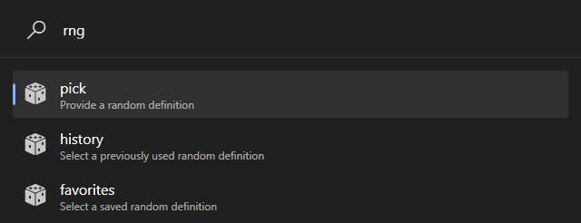
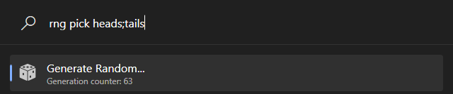
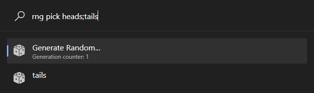
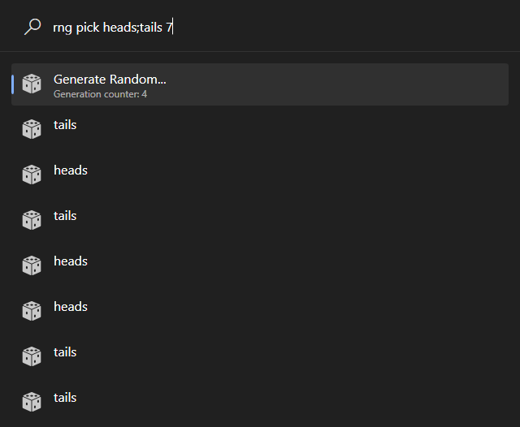
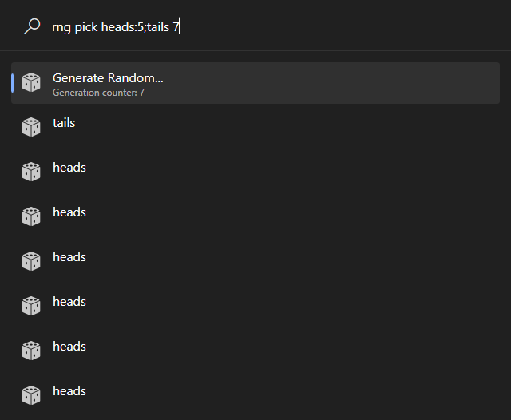
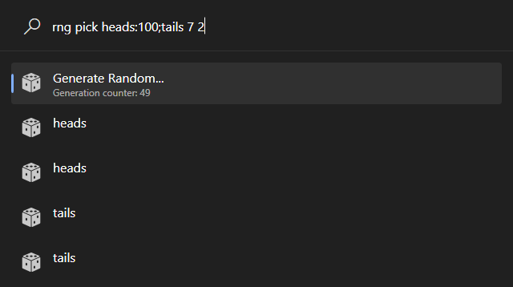
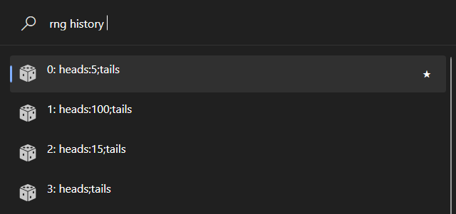
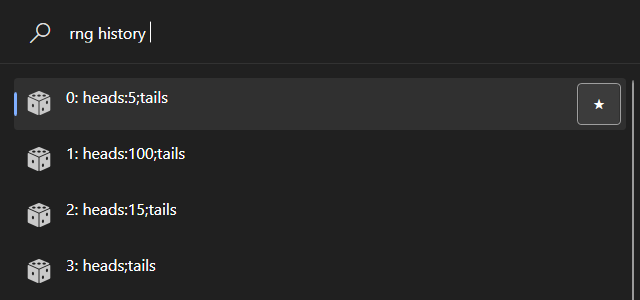
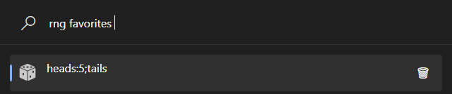

# PowerToys.Run.Plugin.RandomPicker

A [PowerToys](https://github.com/microsoft/PowerToys) plugin to pick stuff randomly

# Installation

## Manual

- Download the latest [release](https://github.com/Heck-R/PowerToys.Run.Plugin.RandomPicker/releases)
- Unzip the contents into the PowerToys Plugin folder  \
  Usual locations include:
  - `C:\Program Files\PowerToys\PowerToys.exe`
  - `%LOCALAPPDATA%\Microsoft\PowerToys\PowerToys Run\Plugins`
- Restart PowerToys

## Automatic

Use [ptr](https://github.com/8LWXpg/ptr), which is a nice plugin manager CLI tool

```
ptr add RandomPicker Heck-R/PowerToys.Run.Plugin.RandomPicker
```

# Features

There are 3 major sections



Both typing and arrow keys and enter (or clicks) can navigate the menu, as it is effectively autofill

## Pick

To define a list, use the following format: `<RandomDefinition>[ <ResultCount>[ <MaxRepCount>]]`

Where
- `<RandomDefinition>` is: `<item>[:weight][;<item>[:weight][...]]`
- `<ResultCount>` and `<MaxRepCount>` are whole numbers, defaulting to `1`

E.g.: `apple:5;peach:2;orange 7 2`  \
Meaning: Pick 7 random elements from `apple`, `peach` and `orange`, but make `apple` have `5` times likely to be chosen (compared to normal) and peach `2` times as likely, but only allow 2 of each to appear at most (which means that there will only be 6 items picked, since all 3 can only appear twice at most -> 6 items will be generated)

To make sure the picking only takes effect when the items are all written out, the picking has to be initiated by selecting the default option at the top



After pressing enter:



### Example images





## History

Show the history of the random definitions (only those for which generation was triggered, and each only once)

Note that only the random definition is saved



Favorites can be saved from the history



## Favorites

Favorites can be selected for picking



Favorites can be removed

# Credits

- Project template: https://github.com/hlaueriksson/Community.PowerToys.Run.Plugin.Templates
- Dice icon: <a href="https://www.freepik.com/icon/dice_60879">Icon by Freepik</a>
